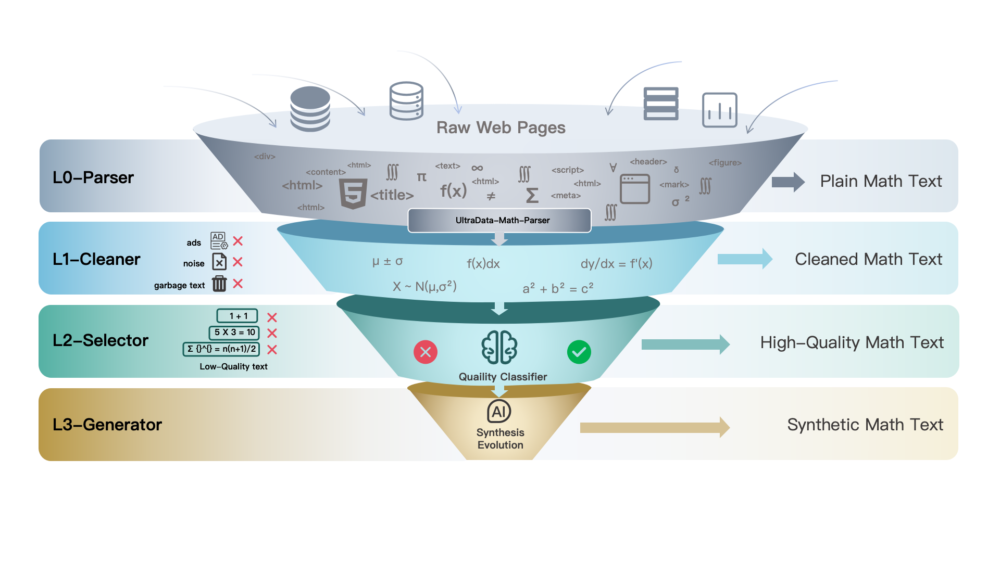

# UltraData-Math

<div align="center">
  
</div>

<div align="center">

[🤗 数据集](https://huggingface.co/datasets/openbmb/UltraData-Math-L1) | [💻 代码仓库](https://github.com/UltraData-OpenBMB/UltraData-Math) | [🇺🇸 English README](README_EN.md)

</div>

## 📚 简介

高质量预训练数据对提升大语言模型的数学推理能力至关重要。然而，现有数学预训练数据构建方案存在以下不足：

- **HTML 解析层面**：通用提取器（如 trafilatura、readability）主要面向新闻/文章场景设计，对数学公式等内容缺乏专门处理，常导致公式结构破坏或丢失；同时论坛类页面的数学讨论部分，难以完整提取。
- **数据质量层面**：现有数据集普遍缺乏系统的质量分级机制，高价值数学内容与低质噪声混杂。
- **数据多样性层面**：主流数据集多源自教科书或竞赛题库，缺少真实网页中的数学讨论与应用场景；合成数据格式单一，难以覆盖多轮对话、多风格表达等多样化需求。

针对上述问题，我们提出 ***UltraData-Math***——一个面向数学推理任务的大规模高质量预训练数据集。本数据集基于 [Ultra-Data](xxx) 的 L0-L4 分级数据处理框架开发，包含四个递进层级：

- **L0 原始数据层**：基于 *magic-html* 开发数学解析器，结合 *w3m* 布局保持渲染与多级回退策略，将 MathML、KaTeX、AsciiMath 标准化为 LaTeX 格式
- **L1 过滤数据层**：通过启发式规则清洗噪声并进行文档级去重
- **L2 精筛数据层**：使用闭源大模型标注种子数据并蒸馏至轻量 Embedding 分类器，实现全量语料的高效质量分级
- **L3 合成数据层**：基于多模型集成生成 Q&A、多轮对话、多风格改写、知识接地教材等多种格式的合成数据

实验表明，在 MiniCPM-1B 架构上，***UltraData-Math*** 在 MATH 基准上达到 **37.02** 分，相较 Nemotron-CC 4plus 提升 **+3.62** 分；在 GSM8K 上达到 **61.79** 分，提升 **+3.34** 分，同时保持代码生成与通用知识能力。

***UltraData-Math*** 已应用于 [MiniCPM 系列](https://huggingface.co/collections/openbmb/minicpm-4-6841ab29d180257e940baa9b) 模型的数学预训练。本仓库开源了数据处理流水线的核心工具与配置。

- **[UltraData-Math-L1](https://huggingface.co/datasets/openbmb/UltraData-Math-L1)**: 大规模高质量数学预训练数据集，包含 159.4B tokens 的网页数学语料。
- **[UltraData-Math-L3](https://huggingface.co/datasets/openbmb/UltraData-Math-L3)**: 高质量合成数学数据集，包含 37.1B tokens 的多格式合成数据（Q&A、多轮对话、知识教材等）。


## 🏗️ 数据处理流水线

为突破现有数学数据集在质量与多样性上的局限，我们建立了一套以"数学内容完整性"和"信息密度"为核心的精细化分级标准。***UltraData-Math*** 采用了 UltraData观点论文提出的 **L0-L4 数据分级体系**，通过标准化的层级定义，实现数学数据资产的有序管理与高效流转。每一级都代表了更高的数据纯度与数学价值，同时也对应着更精细的加工程度。

<div align="center">
  
</div>

| 层级 | 名称 | 功能 | 工具 |
|:---:|:---:|:---|:---|
| **L0** | 原始数据 | HTML 数学解析 | `UltraData-Math-L0-Parser` |
| **L1** | 过滤数据 | 格式修复 + 内容过滤 | `UltraData-Math-L1-Cleaner` |
| **L2** | 精筛数据 | 质量分类模型筛选 | `UltraData-Math-L2-Selector` |
| **L3** | 合成数据 | 多格式数据合成 | `UltraData-Math-L3-Generator` |

---

### L0 - 原始数据（Raw Data）

**定义：** 从 Common Crawl 等网页源经解析器提取的初始数据。针对通用 HTML 提取器在捕获数学公式方面的局限性，我们基于 [magic-html](https://github.com/opendatalab/magic-html) 开发了 `UltraData-Math-L0-Parser`。

#### 🔧 UltraData-Math-L0-Parser

基于 magic-html 的增强版 HTML 解析器，专为数学内容提取优化。

**📊 与原版 magic-html 对比**

| 特性 | magic-html | UltraData-Math-L0-Parser |
|:---|:---:|:---:|
| 统一提取模式 (UnifiedParser) | ❌ | ✅ 自动识别并合并分散帖子|
| 多级回退策略 | ❌ | ✅ `primary` → `wild_text` → `readability` |
| 图片 LaTeX 智能提取 | ❌ | ✅ 从 `alt` 属性恢复公式 |
| 数学容器保护 | ❌ | ✅ 保护 `<math>` 标签不被误删 |
| 表格/图片可配置 | ❌ | ✅ `include_tables` / `include_images` |

**✨ 核心特性**

**1. UnifiedParser - 统一提取模式**

融合 Article（文章）与 Forum（论坛）提取逻辑，自动适配不同页面类型：

```python
from ultradata_math_parser import GeneralParser

parser = GeneralParser()
result = parser.extract(html, base_url=url, html_type="unified")
# 返回: {html, title, text_length, fallback_strategy, forum_assembled}
```

**2. 多级回退策略**

当主体提取内容不足时，自动触发多级回退链，确保内容完整性。

**3. 数学公式格式标准化**

支持多种数学格式转换为统一 LaTeX，并智能从图片 `alt` 属性恢复公式：

| 输入格式 | 转换方式 |
|:---|:---|
| MathML (`<math>`) | XSLT 转换 |
| KaTeX (`.katex`) | 提取 annotation |
| AsciiMath | py-asciimath 转换 |
| LaTeX 图片 | 从 URL/alt 智能恢复 |
| `\begin{equation}` | 直接提取 |


**特征：** 数学公式完整保留，LaTeX 格式统一，作为后续清洗与筛选的基础层资源。

---

### L1 - 过滤数据（Filtered Data）

**定义：** 经过启发式规则清洗的数据，文本格式规范，具备基本的可读性。

**处理手段：**
- **Mapper（格式修复）**：清理不可见字符、连续换行、导航栏/按钮等噪声文本
- **Filter（内容过滤）**：过滤短文、异常长度文本

**特征：** 数据噪声显著减少，格式一致性提高；详见 [`UltraData-Math-L1-Cleaner/README.md`](./UltraData-Math-L1-Cleaner/README.md)。

---

### L2 - 精筛数据（Selected Data）

**定义：** 经过质量评估模型筛选，具备高信息密度与数学教育价值的数据，主题明确，推理逻辑连贯。

**处理手段：**
- 闭源大模型标注种子数据
- 轻量 Embedding 分类器蒸馏，实现全量语料高效打分
- 多维度质量标签（数学深度、推理完整性、教育价值）

**特征：** 保留对模型数学推理能力提升贡献度高的样本，噪声进一步降低，数学内容密度显著提高，是预训练阶段的核心资源。

---

### L3 - 合成数据（Synthetic Data）

**定义：** 经过深度改写或合成的高质量数学数据，结构化程度极高，具备清晰的推理步骤与教育价值。

**处理手段：**
- Q&A 格式合成（问答对生成）
- 多轮对话合成（数学辅导场景）
- 多风格改写（教科书风格、竞赛风格、科普风格）
- 知识点教材生成（基于知识点生成教材式学习材料）

**特征：** 文本可读性强、推理步骤完整、结构规范，样本质量高，是 MidTraining 与 SFT 阶段的核心资源。

## 📈 实验结果

我们采用 **MiniCPM-1.2B** 模型架构与**MiniCPM3-4B**分词器进行实验验证。每个实验均在 **1000 亿 Token** 的训练量下进行，从而能在计算效率可控的参数范围内对数据性能进行全面验证。我们使用Lighteval库进行模型评估，所有评估指标均基于 **Zero-Shot** 设置。评估基准包括：

- **数学推理：** GSM8K、MATH、R-Bench、Math-Bench
- **代码生成：** HumanEval、MBPP
- **综合知识：** MMLU、MMLU-STEM

### L0 解析器消融实验

基于相同来源数据，我们使用不同解析器分别提取后独立训练，直接对比解析策略的效果差异：

| 解析器 | 平均分 | MMLU | GSM8K | HumanEval | math | mbpp_full | mmlu-stem |
|:---|:---:|:---:|:---:|:---:|:---:|:---:|:---:|
| **UltraData-Math-L0-Parser (Ours)** | **43.44** | 51.41 | 54.97 | **31.71** | **28.72** | 47.10 | 46.76 |
| trafilatura + w3m | 42.33 | 50.95 | 54.51 | 27.44 | 27.64 | **47.93** | 45.52 |
| trafilatura | 42.44 | 51.42 | **56.03** | 26.83 | 28.08 | 45.64 | 46.62 |
| Megamath | 42.32 | **51.46** | 54.06 | 29.88 | 26.04 | 45.64 | **46.81** |
| magic-html + w3m | 41.29 | 51.23 | 51.63 | 26.83 | 26.58 | 45.02 | 46.45 |

### 完整评测结果

我们使用单一数据集进行独立训练，以直接对比不同数据源的效果：

| 模型 | 平均分 | MMLU | GSM8K | HumanEval | math | mbpp_full | mmlu-stem | R-bench | Math-bench |
|:---|:---:|:---:|:---:|:---:|:---:|:---:|:---:|:---:|:---:|
| **UltraData-Math (Ours)** | **43.79** | 51.67 | **61.79** | 32.93 | **37.02** | **49.27** | 45.93 | 23.38 | **48.33** |
| Nemotron-cc 4plus mind | 43.45 | **52.09** | 59.97 | 34.76 | 35.96 | 48.03 | **45.99** | **23.51** | 47.25 |
| Nemotron-cc 4plus | 42.62 | 51.96 | 58.45 | **35.37** | 33.40 | 46.47 | 45.67 | 22.74 | 46.92 |
| MegaMath-Web-Pro | 41.38 | **53.16** | 56.71 | 31.71 | 32.12 | 47.10 | **47.15** | 21.23 | 41.83 |
| FineMath-4+ | 40.51 | 50.90 | 56.25 | 29.88 | 29.84 | 48.96 | 44.98 | 18.93 | 44.33 |


## ❤️ 致谢

- **L0 解析层**：[magic-html](https://github.com/opendatalab/magic-html)、[w3m](http://w3m.sourceforge.net/)、[trafilatura](https://github.com/adbar/trafilatura)
- **L3 合成层**：[Qwen2.5-72B-Instruct](https://huggingface.co/Qwen/Qwen2.5-72B-Instruct)、[Qwen3-32B](https://huggingface.co/Qwen/Qwen3-32B)、[GLM-4.5](https://huggingface.co/zai-org/GLM-4.5)
- **种子数据**：[Nemotron-CC-Math](https://huggingface.co/datasets/nvidia/Nemotron-CC-Math-v1)、[MegaMath](https://huggingface.co/datasets/LLM360/MegaMath)、[FineMath](https://huggingface.co/datasets/HuggingFaceTB/finemath)

## 📜 许可证

本项目基于 [Apache 2.0](./LICENSE) 许可证发布。
