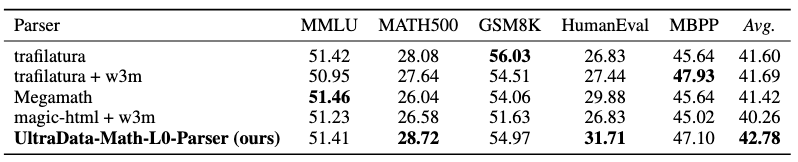
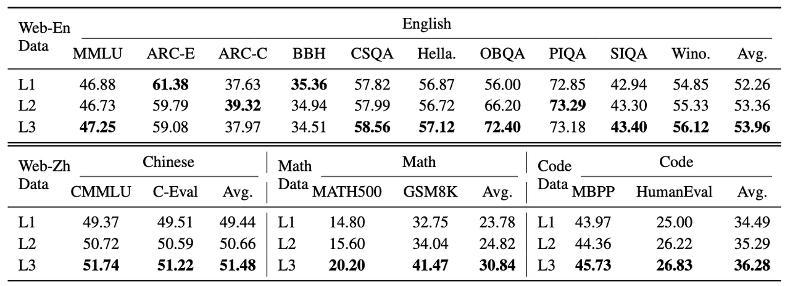
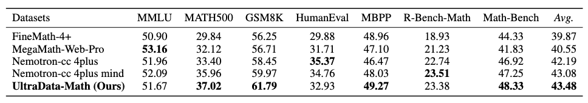

# UltraData-Math

<div align="center">
  
</div>

<p align="center">
<a href="https://huggingface.co/datasets/openbmb/UltraData-Math">🤗 数据集</a> | <a href="https://github.com/UltraData-OpenBMB/UltraData-Math">💻 源代码</a> | <a href="README.md">🇺🇸 English README</a>
</p>

***UltraData-Math*** 是一个面向数学推理的大规模高质量预训练数据集，总计 **290B+ tokens**，涵盖三个递进层级——**L1**（170.5B tokens 网页语料）、**L2**（33.7B tokens 质量精选）、**L3**（88B tokens 多格式精炼），旨在系统性提升大语言模型的数学推理能力。已应用于 [MiniCPM 系列](https://huggingface.co/collections/openbmb/minicpm-4-6841ab29d180257e940baa9b) 模型的数学预训练。

## 🆕 最新动态

- **2026.02.09**：发布 UltraData-Math（290B+ tokens），面向数学推理的大规模高质量预训练数据集，包含三个递进层级（L1/L2/L3）。

## 📚 简介

高质量预训练数据对提升大语言模型的数学推理能力至关重要。然而，现有数学预训练数据构建方案存在以下不足：

- **HTML 解析层面**：通用提取器（如 trafilatura、readability）主要面向新闻/文章场景设计，对数学公式等内容缺乏专门处理，常导致公式结构破坏或丢失；同时论坛类页面的数学讨论部分，难以完整提取。
- **数据质量层面**：现有数据集普遍缺乏系统的质量分级机制，高价值数学内容与低质噪声混杂。
- **数据多样性层面**：主流数据集多源自教科书或竞赛题库，缺少真实网页中的数学讨论与应用场景；合成数据格式单一，难以覆盖多轮对话、多风格表达等多样化需求。

针对上述问题，我们提出 ***UltraData-Math***——一个面向数学推理任务的大规模高质量预训练数据集。本数据集基于 [UltraData](https://ultradata.openbmb.cn/blog/position-paper) 的 L0-L4 分级数据管理框架开发，包含四个递进层级：

- **L0 原始数据层**：基于 *magic-html* 开发数学解析器，结合 *w3m* 布局保持渲染与多级回退策略，将 MathML、KaTeX、AsciiMath 标准化为 LaTeX 格式。
- **L1 过滤数据层**：通过启发式规则清洗噪声并进行文档级去重。
- **L2 精选数据层**：使用闭源大模型标注种子数据并蒸馏至轻量 embedding 分类器，实现全量语料的高效质量分级。
- **L3 精炼数据层**：通过改写、合成生成与精炼，生成具有清晰推理链条的结构化内容，涵盖 Q&A、多轮对话、多风格改写、知识教材等多种格式。

实验表明，在 MiniCPM-1.2B 架构上，***UltraData-Math*** 在 MATH500 基准上达到 **37.02pp**，相较 Nemotron-CC 4plus 提升 **+3.62pp**；在 GSM8K 上达到 **61.79pp**，提升 **+3.34pp**，同时保持代码生成与通用知识能力。

***UltraData-Math*** 已应用于 [MiniCPM 系列](https://huggingface.co/collections/openbmb/minicpm-4-6841ab29d180257e940baa9b) 模型的数学预训练。本仓库开源了数据处理流水线的核心工具与配置。

- **[UltraData-Math-L1](https://huggingface.co/datasets/openbmb/UltraData-Math)**: 大规模高质量数学预训练数据集，包含 170.5B tokens 的网页数学语料。
- **[UltraData-Math-L2](https://huggingface.co/datasets/openbmb/UltraData-Math-L2)**: 经质量模型精选的高质量数学预训练数据集，包含 33.7B tokens 的高质量网页数学语料。
- **[UltraData-Math-L3](https://huggingface.co/datasets/openbmb/UltraData-Math-L3)**: 高质量精炼数学数据集，包含 88B tokens 的多格式精炼数据（Q&A、多轮对话、知识教材等）。


## 🏗️ 数据处理流水线

为突破现有数学数据集在质量与多样性上的局限，我们建立了一套以"数学内容完整性"和"信息密度"为核心的精细化分级标准。***UltraData-Math*** 采用了 [UltraData](https://ultradata.openbmb.cn/blog/position-paper) 论文提出的 **L0-L4 分级数据管理框架**，通过标准化的层级定义，实现数学数据资产的有序管理与高效流转。每一级都代表了更高的数据纯度与数学价值，同时也对应着更精细的加工程度。

<div align="center">
  
</div>

| 层级 | 名称 | 功能 | 工具 |
|:---:|:---:|:---|:---|
| **L0** | 原始数据 | HTML 数学解析 | `UltraData-Math-L0-Parser` |
| **L1** | 过滤数据 | 格式修复 + 内容过滤 | `UltraData-Math-L1-Cleaner` |
| **L2** | 精筛数据 | 质量分类模型筛选 | `UltraData-Math-L2-Selector` |
| **L3** | 精炼数据 | 多格式数据精炼 | `UltraData-Math-L3-Generator` |

---

### L0 - 原始数据（Raw Data）

**定义：** 从 Common Crawl 等网页源经解析器提取的初始数据。针对通用 HTML 提取器在捕获数学公式方面的局限性，我们基于 [magic-html](https://github.com/opendatalab/magic-html) 开发了 `UltraData-Math-L0-Parser`。

#### 🔧 UltraData-Math-L0-Parser

基于 magic-html 的增强版 HTML 解析器，专为数学内容提取优化。

**📊 与原版 magic-html 对比**

| 特性 | magic-html | UltraData-Math-L0-Parser |
|:---|:---:|:---:|
| 统一提取模式 (UnifiedParser) | ❌ | ✅ 自动识别并合并分散帖子|
| 多级回退策略 | ❌ | ✅ `primary` → `wild_text` → `readability` |
| 图片 LaTeX 智能提取 | ❌ | ✅ 从 `alt` 属性恢复公式 |
| 数学容器保护 | ❌ | ✅ 保护 `<math>` 标签不被误删 |
| 表格/图片可配置 | ❌ | ✅ `include_tables` / `include_images` |

**✨ 核心特性**

**1. UnifiedParser - 统一提取模式**

融合 Article（文章）与 Forum（论坛）提取逻辑，自动适配不同页面类型：

```python
from ultradata_math_parser import GeneralParser

parser = GeneralParser()
result = parser.extract(html, base_url=url, html_type="unified")
# 返回: {html, title, text_length, fallback_strategy, forum_assembled}
```

**2. 多级回退策略**

当主体提取内容不足时，自动触发多级回退链，确保内容完整性。

**3. 数学公式格式标准化**

支持多种数学格式转换为统一 LaTeX，并智能从图片 `alt` 属性恢复公式：

| 输入格式 | 转换方式 |
|:---|:---|
| MathML (`<math>`) | XSLT 转换 |
| KaTeX (`.katex`) | 提取 annotation |
| AsciiMath | py-asciimath 转换 |
| LaTeX 图片 | 从 URL/alt 智能恢复 |
| `\begin{equation}` | 直接提取 |


**特征：** 数学公式完整保留，LaTeX 格式统一，作为后续清洗与筛选的基础层资源。

---

### L1 - 过滤数据（Filtered Data）

**定义：** 经过启发式规则清洗的数据，文本格式规范，具备基本的可读性。

**处理手段：**
- **Mapper（格式修复）**：清理不可见字符、连续换行、导航栏/按钮等噪声文本
- **Filter（内容过滤）**：过滤短文、异常长度文本

**特征：** 数据噪声显著减少，格式一致性提高；详见 [`UltraData-Math-L1-Cleaner/README.md`](./UltraData-Math-L1-Cleaner/README.md)。

---

### L2 - 精筛数据（Selected Data）

**定义：** 经过质量评估模型筛选，具备高信息密度与数学教育价值的数据，主题明确，推理逻辑连贯。

**处理手段：**
- 闭源大模型标注种子数据
- 轻量 embedding 分类器蒸馏，实现全量语料高效打分
- 多维度质量标签（数学深度、推理完整性、教育价值）

**特征：** 保留对模型数学推理能力提升贡献度高的样本，噪声进一步降低，数学内容密度显著提高，是预训练阶段的核心资源。

---

### L3 - 精炼数据（Refined Data）

**定义：** 经过深度改写、合成与精炼的高质量数学数据，具有结构化内容、清晰推理步骤和显式教学意图，达到教科书级质量标准。

**处理手段：**
- Q&A 格式生成（包含显式推理步骤的问答对生成）
- 多轮对话合成（数学辅导场景）
- 多风格改写（教科书风格、竞赛风格、科普风格）
- 知识点教材生成（基于知识点生成教材式学习材料）
- 格式修复与增强（修复损坏的 LaTeX 公式、不一致的符号标记，增强内容连贯性）

**特征：** 文本可读性强、推理步骤完整、结构规范，样本质量高，是 MidTraining 与 SFT 阶段的核心资源。

## 📈 实验结果

我们使用 **衰减验证（Decay Verification）** 方法评估数据质量：在 **MiniCPM-1.2B** 基座模型（使用 **MiniCPM3-4B** 分词器，预训练 1.3T tokens）上继续训练 **~100B tokens**（30% 目标数据 + 70% 通用数据）。我们使用 [OpenCompass](https://github.com/open-compass/opencompass) 作为评估框架。评估基准包括：

- **通用英文：** MMLU、ARC-E、ARC-C、BigBench Hard (BBH)、CommonSenseQA、HellaSwag、OpenbookQA、PIQA、SIQA、Winogrande
- **通用中文：** C-Eval、CMMLU
- **数学推理：** MATH500、GSM8K、Math-Bench、R-Bench-Math
- **代码推理：** MBPP、HumanEval

### L0 解析策略有效性

为公平对比不同解析策略，我们在 **2023-2024** 年分布的数据子集上进行实验。我们使用不同解析器重新解析原始 HTML。该对比展示了我们 **L0 解析器的有效性**。

<div align="center">
  
</div>

### 流水线有效性（L1 vs L2 vs L3）

为验证 L0-L3 分级框架的有效性，我们对使用不同层级 UltraData-Math 训练的模型进行了消融实验。与上文 L0 解析器对比（使用 2023-2024 子集）不同，以下结果基于**全量数据集**。

<div align="center">
  
</div>

### 完整评测结果

为与现有公开数学预训练数据集进行对比，我们使用相同的模型架构和训练预算（~100B tokens）在每个数据集上独立训练模型。基线包括 [Nemotron-CC-Math](https://huggingface.co/datasets/nvidia/Nemotron-CC-Math-v1)、[MegaMath-Web-Pro](https://huggingface.co/datasets/LLM360/MegaMath) 和 [FineMath](https://huggingface.co/datasets/HuggingFaceTB/finemath)。所有模型在相同条件下评估以确保公平对比：

<div align="center">
  
</div>

## ❤️ 致谢

- **L0 解析层**：[magic-html](https://github.com/opendatalab/magic-html)、[w3m](http://w3m.sourceforge.net/)、[trafilatura](https://github.com/adbar/trafilatura)
- **L3 精炼层**：[Qwen2.5-72B-Instruct](https://huggingface.co/Qwen/Qwen2.5-72B-Instruct)、[Qwen3-32B](https://huggingface.co/Qwen/Qwen3-32B)、[GLM-4.5](https://huggingface.co/zai-org/GLM-4.5)
- **种子数据**：[Nemotron-CC-Math](https://huggingface.co/datasets/nvidia/Nemotron-CC-Math-v1)、[MegaMath](https://huggingface.co/datasets/LLM360/MegaMath)、[FineMath](https://huggingface.co/datasets/HuggingFaceTB/finemath)

## 📖 引用

如果您觉得 **UltraData-Math** 对您的研究有帮助，请考虑引用：

```bibtex
@misc{ultradata-math,
  title={UltraData-Math},
  author={UltraData Team},
  year={2026},
  url={https://huggingface.co/datasets/openbmb/UltraData-Math},
  publisher={Hugging Face}
}
```

## 📜 许可证

本项目基于 [Apache 2.0](./LICENSE) 许可证发布。
